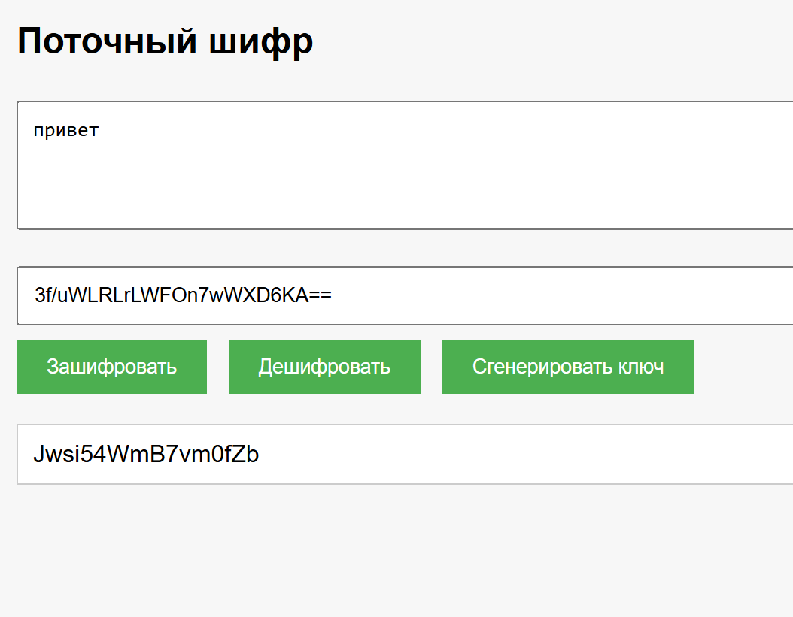
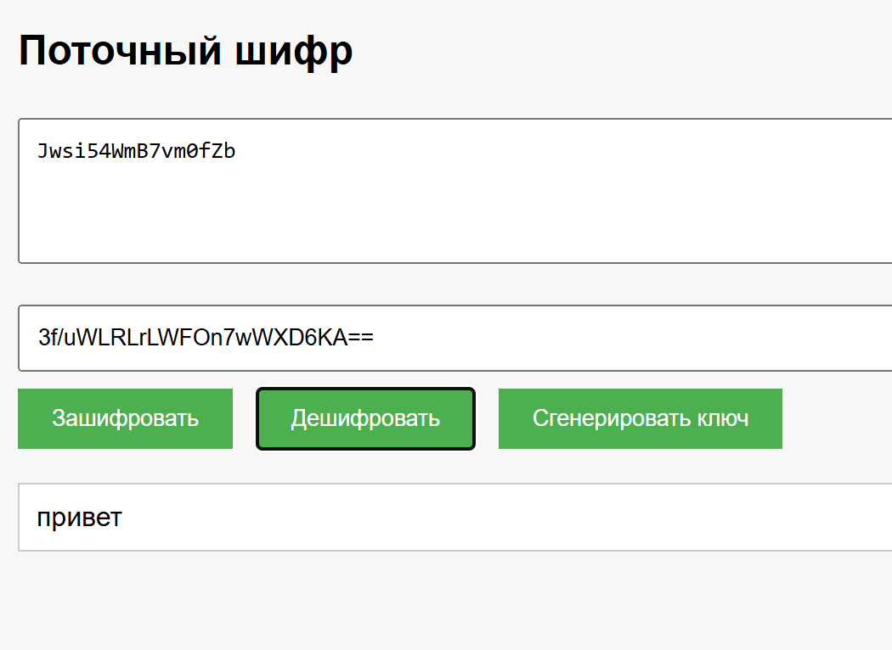

# Поточное шифрование

## Описание
Этот проект представляет собой учебное приложение, демонстрирующее поточное шифрование с использованием генератора псевдослучайной последовательности. Он включает в себя веб-интерфейс и серверную часть, обрабатывающую запросы.

## Краткое описание метода шифрования
Поточное шифрование — это симметричный метод шифрования, где каждый символ открытого текста преобразуется в символ шифротекста с использованием ключевой гаммы. В данном проекте:
- Генерируется случайный 16-байтовый ключ
- На основе ключа создается псевдослучайная последовательность (гамма)
- Шифрование происходит путем применения операции XOR между исходным текстом и сгенерированной гаммой
- Дешифрование выполняется аналогичным образом с той же гаммой

## Структура проекта
- **Handlers/**
  - `WebSocketHandler.cs`: Обработчик WebSocket-соединений.
- **Models/**
  - `RequestMessage.cs`: Модель запроса.
  - `ResponseMessage.cs`: Модель ответа.
- **Services/**
  - `CipherService.cs`: Сервис для выполнения шифрования.
- **wwwroot/**
  - `index.html`: Главная страница веб-приложения.
  - `script.js`: Скрипты для взаимодействия с сервером.
  - `style.css`: Стили для веб-приложения.
- `Program.cs`: Точка входа в приложение.
- `Startup.cs`: Конфигурация приложения.

## Запуск проекта
Для запуска проекта выполните следующие шаги:

1. Убедитесь, что у вас установлен .NET 8.0 SDK.
2. Откройте терминал и перейдите в корневую директорию проекта.
3. Выполните команду:
    ```sh
    dotnet run
    ```
4. Откройте браузер и перейдите по адресу `http://localhost:5000`.

### Что можно сделать в веб-интерфейсе?
1. Ввести текст для шифрования
2. Сгенерировать ключ или ввести существующий
3. Получить зашифрованный текст
4. Расшифровать текст, используя тот же ключ

## Скриншоты

### Шифрование текста


### Дешифрование текста
